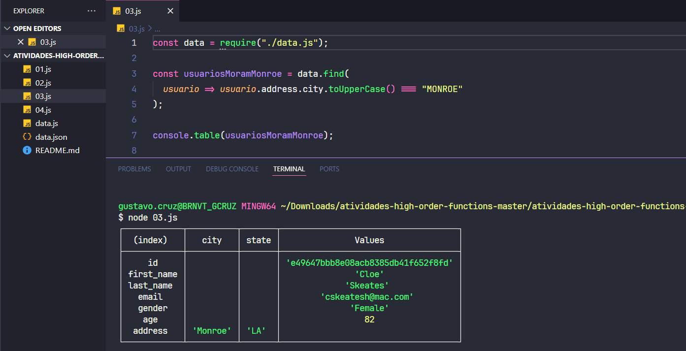

# Exercícios de High Order Functions

## Descrição
### 📝 A partir do vetor contido no arquivo data.js ou data.json faça os exercícios a seguir:

1. Crie uma variável que contenha todas as idades (age) dos usuário - map

2. Crie uma variáveis que tenha apenas os usuários do sexo feminino e com mais de 18 anos - reduce

3. Crie uma variável que procura por um usuário que more na cidade chamada Monroe - find

4. Multiplique a idade de todos usuários por dois e depois realize um filtro nos usuários que possuem no máximo 50 anos

## 🚀 Como executar o projeto

1. **Baixe o código** deste repositório.
2. **Abra o diretório no seu terminal**.
3. **Digite `node`** e o nome do arquivo .js desejado.

## 👨🏽‍💻 Autor

Gustavo Cruz Pinheiro

### 🌐 Me siga nas redes sociais

